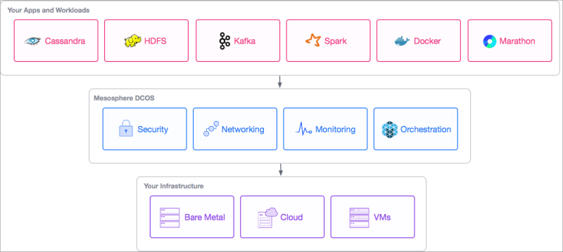
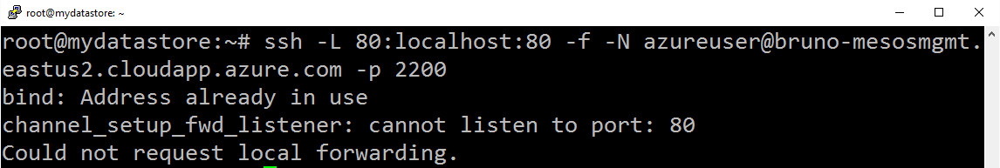

# Containerizing Applications in Azure using DC/OS

## Running a Java Based Web Application and a RESTful Service using Jersey

What is amazing about the technologies that we will be talking about is that we can create a Web oriented application, and in a matter of minutes, have that web service running at scale across the cluster. 

The ability to easily leverage a cluster that supports scaling, failure recovery, and a significant degree of automation is one of the most significant breakthroughs in the IT landscape over the past couple years.

Historically, this type of capability was available only to a select few experts. Thankfully for us, this technology has been democratized. I hope to prove how simple it is to build out a Web oriented application and how easy it is to scale across a cluster of virtually any size.

That's the power of the Azure container service and of a DC/OS cluster.

This solution is built on 100% open source technologies, so there is no vendor lock in.

This is an inspired post. It essentially represents the "aha" moment I had with containers and how amazingly straightforward it was to run restful services across a cluster of almost any size.

Later in this post we will describe exactly what containers are and the differences between containers and images. For the moment let’s just agree that containers make it very easy to package up web applications and run them against a large distributed cluster.

The beauty about this approach is that it is based on **100% open source software**, meaning that you can take the work here and run it almost anywhere. The Azure specific provisioning of infrastructure is completely abstracted away. The Azure Container Service (ACS) really makes this type of work pain-free and simple. Once again, everything in the **ACS** is **100% open source**.

Be sure to see part 1 of this post here:

https://github.com/brunoterkaly/building-restful-service-with-java


### DC/OS - Open Source Cluster Management

DC/OS makes it easy to deploy and run stateful or stateless distributed workloads including Docker containers, Big Data, and traditional apps. DC/OS abstracts your large Azure-based cluster into a single computer, pooling distributed workloads and simplifying rollout and operations.

This post will focus on DC/OS

There have been a couple of seminal papers that have advanced the state-of-the-art, such as this one, whose lead author is the founder of Mesosphere. The purpose of this post is not to dive into all the details that inspired the creation of DC/OS. This white paper is very interesting because it describes the motivations behind the abstraction of scheduling frameworks, such as Hadoop or MPI.


_Figure 1:  Mesos: A Platform for Fine-Grained Resource Sharing in the Data Center_

### Capabilities of DC/OS

These capabilities include:

1.	Label-based service-discovery
2.	Auto Scaling
3.	Constraint-based scheduling
4.	Service Recovery
5.	Launch and monitor apps through a web UI or REST API
6.	Security


### Orchestration

You often hear the term, “Orchestration,” to describe these capabilities. The idea is that you look at your large cluster of virtual machines as a single pool of resources. You do not concern yourself with individual instances of your application. You do not concern yourself with the specific nodes in the cluster that are running your application. You let the orchestration layer manage all these details.  

### Support for common open source software

It is useful to point out that DC/OS has direct support for many of the most common open source software frameworks. So if your goal is to support a highly distributed database, DC/OS supports Cassandra. If you need to do massive data ingestion, DC/OS supports Kafka. If you need to do real-time analytics, there is support for SPARK. Once again, this is software you need to support but don’t want to build out all the supporting code infrastructure to make it happen.



_Figure 2:  Support for Open Source in DC/OS_

### Wrapping your arms around containerization

There is significant debate and confusion around with containerization really means. On one hand there are folks who believe that containerization is just another form of virtualization. However, this is a big misconception, primarily because you generally run one application within a container, whereas a virtual machine typically runs many applications.

There is also the belief that containerization is simply another form of distributed computing, that you are running applications across a large cluster. Perhaps a better way to think about it is that containerization and distributed computing work well together. Containerization simplifies taking an application that has failed and running it on another node. Containerization helps tremendously because an application can be migrated with all its dependencies very easily.

There is also a large contingency in the DevOps space, who view containerization as an excellent way to package up and deliver applications across Dev, Test, and Prod. Because an application is bundled up with all its the dependencies, there is significant confidence that an application will run the same in production as in Test and even Development. You could argue that this is perhaps the most significant contribution that containerization makes to the IT landscape. Frequent, more predictable application updates results in happier customers, happier employees, and higher profit for companies.

### What a distributed cluster looks like in Azure

Even the most simple cluster with DC/OS results in a significant amount of infrastructure being deployed in a public cloud like Azure. If you note in the image below there is a variety of VM’s, load balancers, network interface cards and public IP address and that needs to be provisioned. Likely, as you see in this post, provisioning such a cluster is almost trivial and requires just a few mouse clicks and some basic data input to provision.

In the diagram below you are looking at a Docker Data Center deployment. You will note that a DC/OS deployment is similar in that it will include the typical cluster hardware (VM’s, load balancers, network interface cards and public IP address).


_Figure 3:  The basic infrastructure for an Azure cluster_

### The impossible dream

Distributed computing has come a long way. To start, containerization has come into the picture in a big way over the past few years, affording us the ability to easily package up an application with all its dependencies and running it across the cluster. This has been an important innovation because it makes it much more simple for applications to move among the nodes of the cluster. This means that if individual computers fail or even applications within those computers fail, the system can recover by running containerized applications elsewhere in the cluster.

Distributed computing has also benefited by innovations in the management of clusters with such companies as Mesosphere, who has ome a long to dramatically simplifying the management of large clusters, providing an easy way to think about the collection of computers as a single pool of resources, where you don't have to worry about individual hosts. The software that runs the cluster  keeps track of all the details of the application running on the cluster and provides the ability to recover from failure, regardless of whether individual computers fail in the cluster or whether an individual application fails in the cluster. 

Beyond just error recovery distributed computing needs to be able to scale up an application or scale of town, depending on how many users are how much work an application needs to support.

In summary, the ability to package up applications, combined with the software to run those applications across a cluster has made it economically and technically feasible for companies to support applications at scale in the cloud.


### 0  to 60 faster than beast mode 

The goal is to go 0 to 60 faster than a Tesla in beast mode. Despite the many ways you can talk about containerization, at the end of the day it is about taking an app and running in a fault-tolerant manner at scale.

- **Step 1 -** The Azure Container Service - Building out a Docker Swarm or DC/OS Cluster
- **Step 2 -** Understanding DC/OS as the orchestration layer
- **Step 3 -** Provisioning a DC/OS cluster using the Azure Container Service
- **Step 4 -** Migrating a Java-based Web Application to run containerized
- **Step 5 -** Creating a WAR file from an Eclipse-based PC
- **Step 6 -** Copying WAR file to Linux environment
- **Step 7 -** Setup SSH Tunnel into DC/OS cluster
- **Step 8 -** Understanding and Modifying the Dockerfile for building an image
- **Step 9 -** Tagging and image (applying a version number)
- **Step 10 -** Pushing the new image to hub.docker.com
- **Step 11 -** Viewing the image at hub.docker.com
- **Step 12 -** Running the image from hub.docker.com using the Marathon.json file
- **Step 13 -** Viewing, monitoring, and scaling the app through Marathon, Mesos, and the DC/OS Portal


## Step 1 of 13 - The Azure Container Service - Building out a Docker Swarm or DC/OS Cluster

The Azure Container Service (ACS) provides a very simple way to build out a Docker Swarm or DC/OS cluster. It is 100% Open Source. You select the size, the number of hosts, and choice of orchestrator tools, and Container Service handles everything else.

Choose the tools and solution that best suits your needs for Docker container orchestration and scale operations. Use the Mesos-based DC/OS or use Docker Swarm and Compose for a pure Docker experience.

Many of the familiar open source tools will work without modification. This includes visualizers, monitoring, continuous integration, command line tools, and even future tools as they become available.

You can read about it here:

https://azure.microsoft.com/en-us/services/container-service/


## Step 2 of 13 - Understanding DC/OS as the orchestration layer

DC/OS is a distributed operating system based on the Apache Mesos distributed systems kernel. It enables the management of multiple machines as if they were a single computer. It automates resource management, schedules process placement, facilitates inter-process communication, and simplifies the installation and management of distributed services. Its included web interface and available command-line interface (CLI) facilitate remote management and monitoring of the cluster and its services.

You can read about it here:

https://docs.mesosphere.com/


## Step 3 of 13 - Provisioning a DC/OS cluster using the Azure Container Service

There are a variety of ways to provision a DC/OS cluster on Azure. The easiest way is through the Azure Portal.

#### Getting SSH keys

But before you provision your cluster, you will need an SSH key. Here are the steps on a Linux VM. You will notice let the final step here in the code below is to open up the id_rsa.pub file, which is where the public key is stored. This public key will be needed once we go to the Azure portal to provision a cluster. You will need to paste in this public key during the provisioning process at the portal.  

#### You will need a Docker-enabled Linux VM

We will need to provision a separate Linux VM that has the Docker client tools installed. This VM will not be part of the cluster. It will be used to create our application container and communicate with the DC/OS cluster once it is complete. You could do this directly from a Mac or Windows computer. But we feel the Linux VM is more universal and can be used by everyone.

To be able to get to the Linux terminal below, you will need to provision a "Docker-enabled" Ubuntu VM.

Go to http://portal.azure.com and click on **+New**. Then search for **docker** until you see the **Docker on Ubuntu Server** link.


_Figure 4:  Provision a Linux/Ubuntu VM that has the docker client tools_


You will make the selection below. From there you can follow the guidance here:

https://azure.microsoft.com/en-us/documentation/articles/virtual-machines-linux-quick-create-portal/


_Figure 5:  Choose Docker on Ubuntu Server_

##### SSH into our Docker-enabled VM

We need a public SSH key to create the DC/OS cluster. We will SSH into the Docker Ubuntu VM. We can use **putty** to SSH from a Windows computer. 

For more information on how to SSH into a Linux VM hosted and Azure you can visit this link to learn more:

https://azure.microsoft.com/en-us/documentation/articles/virtual-machines-linux-ssh-from-linux/


The commands below will allow you to obtain a public SSH key they can be used at the Azure portal to provision an ACS/DC/OS cluster.

As part of those steps you will go in as root and install the necessary **openssl** binaries that will be used to generate the public key. You will then go to the folder where the keys have been created and open up id_rsa.pub file, whose key you will copy to the clipboard so that you can paste it into the browser when you are provisioning at the Azure portal.


````bash
sudo su -                    # root access
sudo apt-get install openssl # install if needed
ssh-keygen -t rsa -b 2048    # generate the key
cd ~/.ssh                    # go to the ssh folder
ls -ltr                      # view generated files
vim id_rsa.pub               # open up .pub file and copy the key to the clipboard
````
_Code: Obtaining a public SSH key_

#### Provisioning at the Azure Portal

Once you login to the Azure Portal (portal.azure.com), you can follow these steps below. We will type in "acs,"  which is an abbreviation for the Azure container service. 


_Figure 6:  Click "New." Then search for "ACS"_


_Figure 7:  Entering the cluster name and ssh information_

Now you will enter the information needed to provision:
- Name for cluster
- SSH key (got mine from "~/.ssh")
- Click "OK" then "Purchase"
 


_Figure 8:  Main data entry screen_


Finish the provisioning process:
- Click "OK" then "Purchase"
 


_Figure 9:  Verify validation_


#### Getting the URL for the master and slave nodes

After the provisioning process has completed, we will need to get the URL of our master and slave nodes. This can be achieved by clicking on the **last deployment** link at the Azure portal as seen below.

When the cluster was created, a set of master and child nodes (agent nodes) were created during the provisioning process. You will get a separate URL for each of these type of nodes. This URL is important in future sections of this walk-through. You will copy these URLs to a safe place for future reference. 


_Figure 10:  Choose Last Deployment_

Under deployment history click the first selection as highlighted by the red box. What will appear next is the necessary URLs.


_Figure 11:  Deployment History_

What you will get the information you see below, which is essential for interacting with the provisioned DC/OS cluster.

**MASTERFQDN**
- The URL for the master nodes of the cluster
- bruno-mesosmgmt.eastus2.cloudapp.azure.com

**SSH Endpoint**
- ssh azureuser@bruno-mesosmgmt.eastus2.cloudapp.azure.com -A -p 2200

**AGENTFQDN**
- The URL for the agent or child or slave nodes in the cluster
- bruno-mesosagents.eastus2.cloudapp.azure.com


_Figure 12:  Viewing the URLs for Masters and Slaves_


#### Provisioned infrastructure

Once the provisioning process completes, which can take from 5 to 15 minutes, you will see a variety of infrastructure that has been provisioned. You will see such things as Azure scale sets, which is an easy way to scale up the cluster up and down. You will also see load balancers, network interface cards, and network security groups - to name a few.


_Figure 13:  Viewing the provisioned infrastructure at the portal_

#### Conceptual Underpinnings of a DC/OS Cluster

Alluded to earlier is the fact that there are master nodes and agent nodes that comprise the cluster.

Now might be a good time to go read the white paper that was previously mentioned:

- Explains how the DC/OS cluster is architected
- http://mesos.berkeley.edu/mesos_tech_report.pdf 

In summary, this white paper describes some of the innovations that took place at the AMPLab at Berkeley, where several PhD students developed the technology to manage a large, distributed cluster. It dives into the theory about how resources get managed across the cluster, how master and agent nodes communicate, how containers get scheduled across the nodes, and suggests some solutions for allocating tasks across the limited resources of the cluster. Interestingly, many of the authors continued on to do great things, such as Matei Zaharia, who went on to become the founding member of DataBricks, the creators of Spark.


_Figure 14:  DC/OS Cluster_

A competing technology to cluster management orchestration can be seen below, where we have created a diagram for a Docker Swarm Cluster. The purpose of showing in the diagram is too emphasize that the overall approach to managing large clusters involves the notion of master nodes combined with agent nodes. 

Perhaps the most essential point about these large distributed clusters. It is the master nodes that are scheduling the work and keeping track of all the running containers. It is the slave agent nodes that are actually running the containers.


_Figure 15:  Docker cluster_

## Step 4 of 13 - Migrating a Java-based Web Application to run containerized

As mentioned previously, we are deploying a restful service across the cluster. The restful service is called SimpleRestfulService and will include the following technologies:
- Jersey (RESTful Web Services framework is an open source framework for developing RESTful Web Services in Java)
- Tomcat Http Web Server
- Java as the programming language
- Eclipse as the IDE


_Figure 16:  A web-based Java application that includes Jersey for Restful services_


#### Detailed post explaining how to build the restful service can be found here

https://github.com/brunoterkaly/building-restful-service-with-java/blob/master/README.md


Let's address some of the characteristics of the application we wish to containerized and run across the DC/OS cluster:

- 
-  it is a web-based application built with Eclipse
- It is simply an HTTP get request
- It passes a parameter (course=100)
- This means it will retrieve the course with the id of 100


Below you can see the project created (SimpleRestfulService) that has been completed. We will run the project by right-mouse clicking in Project Explorer and choosing "Run on Server."


_Figure 17:  Running the Eclipse Project_

To call into the restful service, we will type **http://localhost:8080/rest/azurecourse/query/?course=100.**  What we are doing is passing a query parameter of **100** as the **course** variable. This is the way we pass data into a restful service.


_Figure 18:  Typing the URL to call the Restful Service_


**Calling the Restful Service**

After the call executes, the browser returns the JSON data that relates to **course=100.** The data is in a text file so a text editor will appear. In my case, my default editor is **VIM**. Yours could be **notepad** or something else.


_Figure 19:  A text editor appears to open up the JSON data that results from the restful call_

When the text editor opens up, you will see the JSON data that is returned by the restful service. You can see the **courseTitle** is **Building REST in a Container**.


_Figure 20:  The actual JSON data that is returned in VIM (the editor)_


#### Copy WAR file to Ubuntu VM

**Creating a war file**

I've described in great detail how to create this war file from the very beginning. See this post for details.

https://github.com/brunoterkaly/building-restful-service-with-java/blob/master/README.md

**Provisioning a Linux VM that has the docker tooling installed already**

Our next goal is to **copy this war file over to a Linux VM** (running in Azure) because that's the place where we are going to do most of our work in packaging at the application into a container, as well as deploying it to our DC/OS cluster. 

In this next step we will provision a Linux VM that has the docker client tools already installed.

You can learn more about it here:

https://azure.microsoft.com/en-us/marketplace/partners/canonicalandmsopentech/dockeronubuntuserver1404lts/


_Figure 21:  Provisioning a Linux (Ubuntu) VM with the Docker client tools already installed_


Once it is provision you can SSH from a Mac or you can use putty to SSH into this VM. The image below demonstrates that I have SSH'd  to into the machine and then logged in as the root user.

The reason the docker tooling is needed here is because we are going to build our image using the war file with the docker client tools.


 


_Figure 22:  The Linux VM where we will do our work (this VM has all the Docker tooling we will need)_


## Step 6 of 13 - Copying WAR file to Linux environment

##### Using the Putty Tools to copy the WAR file

Now that we do have a war file (in our case it is in the c:\temp\images directory), we can now copy from the Windows environment over to the Linux environment.

If you need to know how to create this war file, see https://github.com/brunoterkaly/building-restful-service-with-java/blob/master/README.md.

We will be using the putty tooling to copy files from a Windows environment to a Linux environment.


_Figure 23:  Copying the war file to the Linux Vm_

Because of permission limitations, notice that I am copying the war file into the /home/azureuser directory. Once the war file makes it onto the Linux VM, we can freely copy it anywhere on that VM.

Here is a text version of the copy command.

````bash
pscp SimpleRestfulService.war azureuser@mydatastore.westus.cloudapp.azure.com:/home/azureuser
````
_Code: The actual pscp command in action (Copying from our Windows PC to our freshly provision Linux VM)_

You can get all the **putty tooling** here:

http://www.chiark.greenend.org.uk/~sgtatham/putty/download.html


## Step 7 of 13 - Setup SSH Tunnel into DC/OS cluster

We will now tunnel into the master node of the cluster for the remainder of this work. Let's review what **tunneling** means and how exactly it applies to the scenario we are pursuing now.

#### Tunnels and Port forwarding

Tunneling is also known as **port forwarding**. We will **tunnel** in from our docker enabled Linux VM to the master node of our DC/OS cluster.The SSH tunnel to the master node uses **local port forwarding**. With local port forwarding, you specify unused local ports that are used to forward traffic to specific remote ports on the master node. 

Think of **tunnel** as a way to send commands from one VM to another. When we create a tunnel  to our master node of our cluster, we are, in effect, sending commands to the cluster itself, even though we are issuing this commands from our docker-enabled VM.

To set up an SSH tunnel using local port forwarding for these interfaces, you use the master public DNS name instead of localhost. 

**There are three types of port forwarding with SSH: **

- **Local port forwarding**
	- Connections from the SSH client are forwarded via the SSH server, then to a destination server 
-	**Remote port forwarding**
	- Connections from the SSH server are forwarded via the SSH client, then to a destination server 
- **Dynamic port forwarding**
	- Connections from various programs are forwarded via the SSH client, then via the SSH server, and finally to several destination servers 

Local port forwarding is the most common type and the approach used here. 

- Local port forwarding lets you bypass an Azure firewall that blocks the DC/OS master nodes.
- Local port forwarding lets you connect from your local computer to another server
- 

#### Dependency on SSH Keys 
 
Setting up an SSH tunnel using local port forwarding requires the public DNS name of the master node and your key pair private key file that you generated previously. This means that the tunnel will need to be created between the Linux VM that has the SSH keys and the DC/OS master node (that contains the public key). As you recall, we provisioned a Linux virtual machine that had all the Docker client tools. That is the same machine where we created the SSH keys. If you want to tunnel in to the DC/OS master node, you need to do it from a computer that has the public keys.

You will need to refer to "*Viewing the URLs for Masters and Slaves*" for the DC/OS Master node URL.

#### Effect of a tunnel

You typically use SSH to allow users to log in to a remote host and execute commands.


_Figure 24:  How SSH and tunneling works_

Once we are tunnel done, that means that all forthcoming commands will operate against the cluster, not the local Ubuntu VM from which we are running these commands. Imagine that you are actually physically running commands directly from the master node.


````bash
ssh azureuser@bruno-mesosmgmt.eastus2.cloudapp.azure.com -A -p 2200
````
_Code: Setting up the SSH tunnel to the master node_

## Step 8 of 13 - Understanding and Modifying the Dockerfile for building an image

Let's talk about docker **images** versus docker **containers**. **Images** are frozen immutable snapshots of live **containers**. **Containers** are running (or stopped) instances of some **image**.

The two are closely related, but distinct. 

From a Java developer perspective, the difference between a Docker **Image** and a Docker **Container** is the same as that of difference between a Java **Class** and an **Object**. A Java Object is the runtime instance of a Class. Similarly, **Container** is the runtime instance of an **Image**.

Make sense? If not, here is some more information that might help.


#### What's an Image?

An image is an inert, immutable, file that's essentially a snapshot of a container. Images are created with the **build** command, and they'll produce a container when started with **run**. Images are stored in a Docker registry such as **hub.docker.com**. Because they can become quite large, images are designed to be composed of layers of other images, allowing a miminal amount of data to be sent when transferring images over the network.

Local images can be listed by running the docker images command. This is after, of course, we have either built the image or pulled it from the registry.

#### Understanding Dockerfile

The goal is to run our Java application in a container. To get this done a few things need to happen. First, we need to create a special text file called, "Dockerfile." You can think of this text file as a blueprint for building our image. This is the preferred approach to building at your images, mostly because it is self-documenting. An important point here is that images leverage a layered architecture, meaning that you can use the image that we will create as a base image for other images.

The text file looks like this:


_Figure 25: The contents of Dockerfile_

You can edit this file as follows:

````bash
cd ~                                               # go to root folder                         
cp /home/azureuser/SimpleRestfulService.war .      # make sure the war file is in the current directory
vim Dockerfile                                     # edit Dockerfile
````
_Code: Copying /home/azureuser/SimpleRestfulService.war to root folder_ 


_Figure 26: Copying SimpleRestfulService.war to root folder_


There's a few things to notice about this text file. You can see that we start with a tomcat base image (tomcat:8.0.20-jre8). Think of this base image as a Web server that is ready to go, complete with a tomcat implementation, as well as some of the Java support that is needed to run our Java-based application. The other thing you should notice is that we are copying our war file directly into the tomcat Web server folder. Finally, this base images is already available at hub.docker.com.

You can read about this base image here at: https://hub.docker.com/r/_/tomcat/

#### Building the image

At this point we have everything we need to start building our image. We have the war file that we addressed earlier. And we also have the Dockerfile, which is the blueprint for our image.

The next step is to issue the **docker build" command.

````bash
docker build -t mywebapp .
````
_Figure 27: Building our image (called mywebapp)_

Here is the output of our command. The image id is produced, **65b919f9b22c**. This **image id** is very important because it is used in the **tag** command, which defines the image label and version number.

The first red box designates the docker build command, which is the command that builds out the image leveraging the contents of Dockerfile. As the command executes you can see the base image that is used (second red box). You can also see that we are copping the war file into the web folder for tomcat (/usr/local/tomcat/webapps).

Finally the last red box indicates the image ID. This is an important ID because it is used in future commands once we indicate a version number for our image. Once the version number is specified, we are ready to push this image up to the Docker Registry (hub.docker.com).


_Figure 28: The Docker Build command in action_


#### Verifying our image

Now that our image is built, we can issue a command that actually verify its existence. But there's more to this than just verifying its existence. As explained previously, once the image was built, the image ID was automatically created. This image ID is needed to define a label and version number, which is necessary for pushing the image to be uploaded up to the Docker Registry (hub.docker.com).

Notice the **image id** does match (65b919f9b22c).


## Step 9 of 13 - Tagging an image (and applying a version number)

There are two ways to tag images: using the **docker tag** command and passing the **-t** flag to **docker build**. In both cases, the argument is of the form **repository_name:tag_name** e.g. docker tag myrepo:mytag. If the repository is to be uploaded to the Docker Hub, the repository name must be prefixed with a slash and the Docker Hub user name e.g. amouat/myrepo:mytag. 

Notice we use the **image id** to tag the image. My repository is called **brunoterkaly**. The **tag name** is **mywebapp** and the version is **2.0**.

Be warned that is a bad practice to use the **latest **tag. It will not be automatically updated. If you pull an image marked latest, docker will **not **take care of checking it is still the newest version before running it each time. This is definately not the case – just as with every other tag, you still need to manually docker pull new versions.

````bash
docker tag 65b919f9b22c brunoterkaly/mywebapp:3.0
````
_Code: The docker tag command_

Notice that the **image ID** was used in the **docker tag** command. Also notice that a **version number** was provided (**3.0**). Finally, notice that there's also a **docker images** command that was issued to list out the images that are present on the Linux VM.

The syntax for docker tag looks like this:


_Figure 29: Syntax for the docker tag command_


## Step 10 of 13 - Pushing the new image to hub.docker.com

Now that the **image** has been created, the next step is to **push** it out to the **Docker Registry**, so that it is available to others to run as a **container**. 

Jsut to be clear, use **docker push** to share your images to the **Docker Hub registry** or to a self-hosted one. You will need credentials but those are managed by docker login. The assumption here is that you've created a presence on hub.docker.com.


````bash
docker push brunoterkaly/mywebapp:3.0
````
_Code: Pushing up to the docker registry_

Note the command is pushing up the image on the local file system. The Docker Hub is a public registry maintained by Docker, Inc. It contains images you can download and use to build containers. It also provides authentication, work group structure, workflow tools like webhooks and build triggers, and privacy tools like private repositories for storing images you don’t want to share publicly.

The **docker push** command is very efficient. Notice that for much of the binary the output reads, "image already exists." This means that the **docker push** command will only upload portions of the binary that have not been previously uploaded, dramatically improving upload performance.


_Figure 30: Applying the docker push command_


## Step 11 of 13 - Viewing the image at hub.docker.com

In this next, we are going to navigate to the docker hub registry portal and verify that the image has been pushed. The assumption here is that you have created an account and have logged in.

Note that the docker Registry now displays the pushed image. We can click on the details button to actually get the version number information, as well as other metadata.


_Figure 31: Verifying that our image exists in hub.docker.com_


Note that version **3.0**, as well as previous versions is available from the **docker registry**.


_Figure 32: Drilling down and viewing the version number_


_Figure 33: Applying the docker push command_


Note that the docker Registry now displays the pushed image. We can click on the details button to actually get the version number information, as well as other metadata.


_Figure 34: Verifying that our image exists in hub.docker.com_


Note that version **3.0**, as well as previous versions is available from the **docker registry**.


_Figure 35: Drilling down and viewing the version number_


## Step 12 of 13 - Running the image from hub.docker.com using Marathon.json file

Finally,we are at the point where we can physically run this **image** as a **container** across the cluster. 
Before we can run this **image**, we will need to create a JSON formatted text file that describes how we would like to run the **image** across our DC/OS cluster.

Most of this is self-explanatory.Most of what you see here is standard syntax to running tomcat. The notable fields are **"id"** and **"image"**.


````json
{
  "id": "/mywebapp",
  "instances": 1,
  "cpus": 1,
  "mem": 512,
  "container": {
    "type": "DOCKER",
    "docker": {
      "image": "brunoterkaly/mywebapp",
      "network": "BRIDGE",
      "portMappings": [
        { "protocol": "tcp", "hostPort": 80, "containerPort": 8080 }
      ]
    }
  },
  "requirePorts": true,
  "acceptedResourceRoles": [
    "slave_public"
  ],
  "env": {
    "JAVA_OPTS": "-Xms256m -Xmx256m"
  },
  "healthChecks": [
    {
      "gracePeriodSeconds": 120,
      "intervalSeconds": 30,
      "maxConsecutiveFailures": 3,
      "path": "/",
      "portIndex": 0,
      "protocol": "HTTP",
      "timeoutSeconds": 5
    }
  ]
}

````
_Code: marathon.json_


So before we actually run our image is a container, let's make sure we establish a tunnel to the master nodes by executing the command below. The idea is that we want to communicate with the cluster and the command below makes that possible. 

Port forwarding is useful because it can help you get around pesky firewall restrictions.

The code below is saying forward my local port 80 to port 80 on the master node. Because this command has been run previously, you are seeing "Could not request local forwarding." You can ignore this message.

````
sudo ssh -L 80:localhost:80 -f -N azureuser@bruno-mesosmgmt.eastus2.cloudapp.azure.com -p 2200
````



_Figure 36:  Establishing the tunnel_

We are now ready to actually issue a **curl** command to run the **image** a **container**.


To run our container using the **marathon.json** file, you will use the **curl **utility.

If the **curl** command is not available on your system, here's the appropriate command to install it.

````
sudo apt-get update && apt-get install -y curl --no-install-recommends
````

The **curl** command you see below is used to run our **image** as a **container**. You can see that the **marathon.json** is being directly accessed. Also notice that **localhost** is being used in the syntax, which relies on the fact that a **tunnel** has been established.

````
curl -X POST http://localhost/marathon/v2/apps -d @marathon.json -H "Content-type: application/json"
````


_Figure 37:  Running the container_

At this point we are up and running. Our container is executing on the cluster. Granted, it is only running 1 copy. We'll talk about scaling in a future post.

We can verify that is running by pointing our browser to the agent DC/OS nodes.

````
http://bruno-mesosagents.eastus2.cloudapp.azure.com/SimpleRestfulService/rest/azurecourse/query?course=101
````

You should get the exact same result as explained previously, in **Calling the Restful Service**.

You can also use curl to execute a restful query as follows:

````
curl http://bruno-mesosagents.eastus2.cloudapp.azure.com/SimpleRestfulService/rest/azurecourse/query?course=101
````


_Figure 37:  Running a curl command_


## Step 13 of 13 - Viewing, monitoring, and scaling the app through Marathon, Mesos, and the DC/OS Portal

What would be helpful is to be able to use a browser to view get information about the DC/OS cluster.

With a Secure Shell (SSH) tunnel established, you you browse to http://localhost/ from your Windows or Mac PC. This loads the DC/OS web UI and shows information about the cluster, such as used resources, active agents, and running services and more.

It looks like this:


_Figure 38:  Running the container_

**How to establish a tunnel from a Windows PC**

In order for **http://localhost/marathon** to work, a tunnel needs to be setup between your Windows PC and the DC/OS cluster.

A few steps are involved:
- Convert ssh private key id_rsa to Putty .ppk
- Setting the **auth** section
- Setting up the **tunnel**


### How to convert ssh private key id_rsa to Putty .ppk 

Start by going to our previously provisioned Docker-enabled Linux VM and copy the generated keys to Windows. We will need to convert them to .ppk files.


````bash
$ pscp azureuser@mydatastore.westus.cloudapp.azure.com:/home/azureuser/tempssh/* c:\temp\ssh
````

- This how to will show how to convert **id_rsa** keys that were already created on Linux, without a passphrase, **to .ppk extension** so it can be used with Putty on a Windows box.
- Download **PuttyGen** from here and open it. Once it opens click on **Conversions** => **Import Key**.
- Search for the **id_rsa** key on you computer.
- Click on “**Save Private Key**” and “Yes” to save without a passphrase.
- Choose a location and a name for the new .ppk key.
- Now go to putty and add a path to the key so you can create a connection.
 
Notice for **host name** that we entered the URL for the master nodes:
- **bruno-mesosmgmt.eastus2.cloudapp.azure.com**

You can choose to **save the session**. You can see we called ours **dcos-tunnel.**


_Figure 39:  Setting up a tunnel to DC/OS from Windows using Putty_

**Setting up Connection/SSH/Auth**

In the **Category ** you need to now import the ppk file you just created as seen below.


_Figure 40:  Importing the PPK file_

**Setting up the tunnel (Connection/SSH/Tunnels)**

Notice in the **forwarded ports** section, we entered **L80 localhost:80**.


_Figure 41: Setting up the tunnel_


Once all this is setup, you can click **Open** to establish the tunnel.

You will see a Putty window that indicates the tunnel is active.


_Figure 42: Setting up the tunnel_

**Navigating to http://localhost/marathon**

You should be able to see the running application in the browser. There are a bunch of the capabilities that are beyond the scope of this post.


_Figure 43: Validating our running application_

For example, you can choose to **destroy** the application through the portal. Just click on the app and follow the screen below.


_Figure 44: Stopping your running applications_

There is also the **http://localhost/mesos** interface to see **active** and **completed** tasks. 


_Figure 45: Stopping your running applications_


### Conclusion

This has been a VERY big post with a TON of details. We hope it helped you understand how to run web services across a DC/OS cluster in Azure.

For more information, this just in:

http://www.nextplatform.com/2016/07/27/mesos-reaches-milestone-adds-native-docker/


