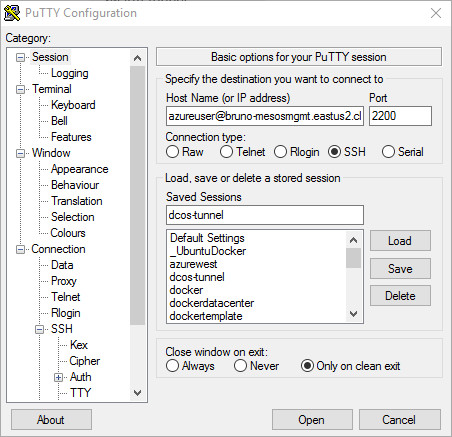

# Building a Java-based Restful Service to run in DC/OS

## Building a Restful Service using Jersey in Eclipse (Mars 4.2)

The purpose of this post is to end up with a WAR file. This war file represents a Java application that supports Restful queries.

We will build the restful application first, and then produce a war file. This war file will then be used in another blog post which will demonstrate how to containerize this restful application and scale across a cluster.

Two types of clusters will be supported using the Azure container service. The first cluster will be a Mesosphere cluster, later followed up by a Docker Swarm cluster.

What is amazing about the technologies that we will be talking about is that we can create this restful service, and in a matter of minutes have that restful service running at scale across the cluster. 

The ability to easily leverage a cluster that supports scaling, failure recovery and a significant degree of automation is one of the most significant breakthroughs in the IT landscape over the past couple years.

Historically, this type of capability was available only to a select few experts. Thankfully for us, this technology has been democratized. I hope to prove how simple it is to build out a Web oriented application and easily scaling across a cluster of virtually any size.

That's the power of the Azure container service and of a DC/OS cluster.

This solution is built on 100% open source technologies.

Be sure to see part 2 of this post here, where we actually run this service in an Azure hosted cluster.

https://github.com/brunoterkaly/run-dcos-on-azure

### This post will demonstrate

This post assumes nothing about what you have already set up on the development computer. I will be using Windows 10 as my operating system, but the same steps will work across any environment where the Eclipse IDE is supported.


- **Step 1 -** A demonstration of the final application that we will build
- **Step 2 -** The tools and technologies that I have installed to make this possible 
- **Step 3 -** Step-by-step instructions and the instructions on how to build out this project 
- **Step 4 -** The creation of a WAR file  that represents the completed application to be containerized 

## Step 1 of 4 - demonstration of the final application that we will build

Let's begin by showing you with a completed application that we will build this post. We will be using Eclipse and you can see that in the image below.

The project is called SimpleRestfulService. You are seeing the completed version. We will run the project by right-mouse clicking in Project Explorer and choosing "Run on Server."

Be sure to see part 2 of this post here, where we actually run this service in an Azure hosted cluster.

https://github.com/brunoterkaly/run-dcos-on-azure


_Figure 1:  Running the Eclipse Project_

To call into the restful service, we will type **http://localhost:8080/rest/azurecourse/query/?course=100.**  What we are doing is passing a query parameter of **100** as the **course** variable. This is the way we pass data into a restful service.


_Figure 2:  Typing the URL to call the Restful Service_

After the call executes, the browser returns the JSON data that relates to **course=100.** The data is in a text file so a text editor will appear. In my case, my default editor is **VIM**. Yours could be **notepad** or something else.


_Figure 3:  A text editor appears to open up the JSON data that results from the restful call_

When the text editor opens up, you will see the JSON data that is returned by the restful service. You can see the **courseTitle** is **Building REST in a Container**.


_Figure 4:  The actual JSON data that is returned in VIM (the editor)_


## Step 2 of 4 - The tools and technologies that I have installed to make this possible 

There are 3 technologies that I have installed to develop the Java Application.

- **Eclipse Mars (4.52)**
	- **Purpose:** Java IDE
	- **Download:** http://www.eclipse.org/downloads/packages/release/Mars/M1
- **Apache Maven**
	- **Purpose:** Maven is a build automation tool used primarily for Java projects
	- **Download:** https://maven.apache.org/download.cgi
- **Apache Tomcat**
	- **Purpose:** The Apache Tomcat ® software is an open source implementation of the Java Servlet, JavaServer Pages, Java Expression Language and Java WebSocket technologies
	- **Download:** I am running version 8 at http://tomcat.apache.org/download-80.cgi

## Step 3 of 4 - Step-by-step instructions and the instructions on how to build out this project 

#### Step 3A - File New Project

This step is simply creating a new Eclipse project.

Start by choosing "File/New/Dynamic Web Project." Provide the name you wish to use. I used **SimpleRestfulService**.


_Figure 5:  Creating a new Dynamic Web Project_

You should see **SimpleRestfulService** in the **Project Explorer.**


_Figure 6:  Eclipse Project Explorer_

#### Step 3B - Convert to Maven project

You now need to convert the project to a **Maven** project. Do this by right-mouse clicking on the project name and choosing "Configure/Convert to Maven Project."


_Figure 7:  Converting to a Maven project_

#### Step 3C - Edit pom.xml

Once you convert, a dialog box will show up indicating that a **pom.xml** file will be created. 

POM stands for "Project Object Model". It is an XML representation of a Maven project held in a file named pom.xml. We will use this file to link to external libraries. Paste the following code into your **pom.xml** file. You will replace all the existing code inside of **pom.xml**

For the most part, because we wish to use the Jersey Libraries, we will use the pom.xml to include them into our Eclipse/Maven Project.

**What is Jersey?**

In order to simplify development of RESTful Web services and their clients in Java, a standard and portable JAX-RS API has been designed. Jersey RESTful Web Services framework is open source, production quality, framework for developing RESTful Web Services in Java that provides support for JAX-RS APIs and serves as a JAX-RS (JSR 311 & JSR 339) Reference Implementation.


_Figure 8:  Converting to a Maven Project_

Just click **Finish** below. You need not modify anything here.


_Figure 9:  Wizard used to create pom.xml_

 


_Figure 10:  The generated pom.xml file_

This is the code that is generated that you will replace. Replace the contents of **pom.xml** with the code below.

```xml
<project
    xmlns="http://maven.apache.org/POM/4.0.0"
    xmlns:xsi="http://www.w3.org/2001/XMLSchema-instance"
	xsi:schemaLocation="http://maven.apache.org/POM/4.0.0 http://maven.apache.org/xsd/maven-4.0.0.xsd">
    <modelVersion>4.0.0</modelVersion>
    <groupId>SimpleRestfulService</groupId>
    <artifactId>SimpleRestfulService</artifactId>
    <version>0.0.1-SNAPSHOT</version>
    <packaging>war</packaging>
    <build>
        <sourceDirectory>src</sourceDirectory>
        <plugins>
            <plugin>
                <artifactId>maven-compiler-plugin</artifactId>
                <version>2.3.1</version>
                <configuration>
                    <source>1.7</source>
                    <target>1.7</target>
                </configuration>
            </plugin>
			<plugin>            
			  <groupId>org.apache.maven.plugins</groupId>
			  <artifactId>maven-war-plugin</artifactId>
			  <configuration>
                    <webXml>${project.basedir}/WebContent/WEB-INF/web.xml</webXml> 
			  </configuration>
			</plugin>            
        </plugins>
    </build>
    <dependencies>
        <dependency>
            <groupId>asm</groupId>
            <artifactId>asm</artifactId>
            <version>3.3.1</version>
        </dependency>
        <dependency>
            <groupId>com.sun.jersey</groupId>
            <artifactId>jersey-bundle</artifactId>
            <version>1.19</version>
        </dependency>
        <dependency>
            <groupId>org.json</groupId>
            <artifactId>json</artifactId>
            <version>20140107</version>
        </dependency>
        <dependency>
            <groupId>com.sun.jersey</groupId>
            <artifactId>jersey-server</artifactId>
            <version>1.19</version>
        </dependency>
        <dependency>
            <groupId>com.sun.jersey</groupId>
            <artifactId>jersey-core</artifactId>
            <version>1.19</version>
        </dependency>
        <dependency>
            <groupId>javax.servlet</groupId>
            <artifactId>javax.servlet-api</artifactId>
            <version>3.1.0</version>
        </dependency>
        <dependency>
			<groupId>org.glassfish.jersey.bundles.repackaged</groupId>
			<artifactId>jersey-guava</artifactId>
			<version>2.6</version>
		</dependency>
		<dependency>
		    <groupId>org.glassfish</groupId>
		    <artifactId>javax.json</artifactId>
		    <version>1.0.4</version>
		</dependency>

    </dependencies>
</project>
``` 
_Code: pom.xml_

#### Step 3D - Generate Deployment Descriptor Stub


A deployment descriptor (web.xml) tells the application container how the web app should be configured. This is where you register your servlets and filters, add context parameters, and more.


_Figure 11:  Generating the Deployment Descriptor file_

You will need to add a file called **web.xml** to the following folder. Be sure to right-mouse click on **WB-INF**


_Figure 12:  Targeting the WEB-INF folder_

Select "New/Other.."


_Figure 13:  Adding web.xml to WEB-INF folder_

Select "XML File."


_Figure 14:  Specifying an XML file_

Name the file **web.xml**.


_Figure 15:  Naming the file web.xml_

Paste the following code into **web.xml.** Notice that the startup web page is **Index.html.** Let's add this next to our project.

```xml
<?xml version="1.0" encoding="UTF-8"?>
<web-app xmlns:xsi="http://www.w3.org/2001/XMLSchema-instance"
	xmlns="http://java.sun.com/xml/ns/javaee" xmlns:web="http://java.sun.com/xml/ns/javaee/web-app_2_5.xsd"
	xsi:schemaLocation="http://java.sun.com/xml/ns/javaee http://java.sun.com/xml/ns/javaee/web-app_3_0.xsd"
	version="3.0">
	<display-name>SimpleRestfulService</display-name>
	<welcome-file-list>
		<welcome-file>Index.html</welcome-file>
	</welcome-file-list>
 
	<servlet>
		<servlet-name>SimpleRestfulService</servlet-name>
		<servlet-class>com.sun.jersey.spi.container.servlet.ServletContainer</servlet-class>
		<load-on-startup>1</load-on-startup>
	</servlet>
	<servlet-mapping>
		<servlet-name>SimpleRestfulService</servlet-name>
		<url-pattern>/rest/*</url-pattern>
	</servlet-mapping>
</web-app>

```
_Code: web.xml_


_Figure 16:  The final web.xml file_


#### Step 3E - Adding Index.html to the project

Even though this is a simple restful service, we will indicate a simple startup page. Right-mouse click on **WebContent** and choose "New/HTML File."


_Figure 17:  Adding an HTML File (Index.html)_


_Figure 18:  Naming the html file (Index.html)_


_Figure 19:  Editing Index.html_


#### Step 3F - Adding the core Java Code for the Restful Service

It is time to now add the main code for our restful service. The two files are;

- **AzureCourse.java**
	- A simple object that represents the data model
- **SimpleRestfulService.java**
	- The main entry point for our restful service. Will return a AzureCourse object formatted as JSON data, as shown in the intro demo.

Right-mouse click on the project name and choose "New/Class."


_Figure 20:  Adding AzureCourse.java_

Enter the details for the new source code file.

- Provide a **package** name
	- **com.terkaly**
- Specify a source code file **name**
	- **AzureCourse.java**


_Figure 21:  Name the source code module AzureCourse.java_

Paste in the following code.

````java
package com.terkaly;

import javax.xml.bind.annotation.XmlRootElement;

@XmlRootElement
public class AzureCourse {

    public AzureCourse() { }
    
    public AzureCourse(String courseNumber, String courseTitle) {
        this.CourseNumber = courseNumber;
        this.CourseTitle = courseTitle;
    }
    
    // Make sure it is private
    private String CourseNumber;
    private String CourseTitle;
    private String Notes;
    
    // Jersey tooling uses getter methods
    public String getCourseNumber() {
		return CourseNumber;
	}

	public void setCourseNumber(String courseNumber) {
		CourseNumber = courseNumber;
	}

	public String getCourseTitle() {
		return CourseTitle;
	}

	public void setCourseTitle(String courseTitle) {
		CourseTitle = courseTitle;
	}

	public String getNotes() {
        return this.Notes;
    }
    
    public void setNotes(String notes) {
        this.Notes = notes;
    }
	@Override
	public String toString() {
		return "AzureCourse [courseNumber=" + CourseNumber + ", courseTitle=" + CourseTitle + "]";
	}
	
}
````
_Code: AzureCourse.java_

**Repeat process for SimpleRestfulService.java**

Right-mouse click on the project name and choose "New/Class."


_Figure 22:  Adding AzureCourse.java_

As before, provide package name and file name.



_Figure 23:  Name the source code module SimpleRestfulService.java_

Paste in the following code.

````java
package com.terkaly;


import java.util.ArrayList;
import java.util.HashMap;
import java.util.Map;

import javax.ws.rs.GET;
import javax.ws.rs.Path;
import javax.ws.rs.Produces;
import javax.ws.rs.QueryParam;
import javax.ws.rs.core.Response;


import org.json.JSONException;

@Path("azurecourse")
public class SimpleRestfulService {

 private Map < String, AzureCourse > map = new HashMap < String, AzureCourse > ();

 public SimpleRestfulService() {
  AzureCourse azureCourse = new AzureCourse("100", "Building REST in a Container");
  azureCourse.setNotes("REST in Mesosphere");
  map.put(azureCourse.getCourseNumber(), azureCourse);
  AzureCourse azureCourse2 = new AzureCourse("101", "Mesosphere and Orchestration");
  azureCourse.setNotes("Run your containers");
  map.put(azureCourse2.getCourseNumber(), azureCourse2);
 }

 // Execute with http://localhost:8080/SimpleRestfulService/rest/azurecourse/query?code=100
 @GET
 @Path("query")
 @Produces("application/json")
 public ArrayList < AzureCourse > getData(@QueryParam("course") String course) throws JSONException {
  try {
   ArrayList < AzureCourse > list = new ArrayList < AzureCourse > ();
   AzureCourse result = (AzureCourse) map.get(course);
   list.add(result);
   return list;

  } catch (Throwable t) {
   System.out.println(t.getMessage());
  }
  return null;
 }
}
````
_Code: SimpleRestfulService.java_

#### Step 3G - We are ready to compile

We are code complete at this point. The project is ready to run. Save and close all files.

We need Maven to bring in the dependencies (Jersey, etc) from the pom.xml file. Right-mouse click and choose "Maven/Update Project." You will need to repeat this command again later. Stay tuned for that guidance.


_Figure 24:  Maven/Update Project_

**Checking the Build Path**

My install had a problem understanding the import statement in my .java file to remedy this problems. 


_Figure 25:  Verifying the Build Path_

I went to the “Order and Export” and made all the possible selections. Not all of them were excepted, but this appeared to solve some of the issues oddly enough, I had to re-paste the content for pom.xml.  This might’ve been an error that I had done, but re-pasting it seemed to work, along with the changes made to the build path.


_Figure 26:  Specify The "Order And Export"_

Although they did not all stick, I did make the following selections.


_Figure 27:  Selecting All Available Entries_

**Run As/Maven Clean, Run As/Maven Install**


Eclipse can be a little fickle so I end up running for commands over and over. Those commands are:

- From the menu system
	-	Project/Clean
	-	ProjectmBuild
-	From Right-Mouse Clicking on Project
	-	Maven/Update Project
	-	Run As/Maven Clean
	-	Run As/Maven Install


_Figure 28:  Selecting Maven Clean_

Ultimately it's the "Run As/Maven Install" that compiles the project so you can run it.


_Figure 29:  Selecting Maven Install_


#### Step 3H - We are ready to run

Now we are ready to test the finished app. 

The process to test the application is the exact same as we demonstrated in step one earlier in this post. You’re going to right-mouse click on the project, and choose “Run As/Run on Server.”
And of course the response is that some JSON data is returned that can be opened in your favorite editor or saved to disk through the browser.


_Figure 30:  Issuing a Restful Query with HTTP_

## Step 4 of 4 - The creation of a WAR file  that represents the completed application to be containerized 

In this final step four of four, we are ready to produce the war file, which can be thought of as a zipped up version of our entire application that can be copied to a Tomcat Web server for execution.
It’s a simple case of right-mouse clicking and selecting “Export/War File."


_Figure 31:  Exporting the WAR file_

Provide a name and destination for the war file


_Figure 32: Providing a name for the WAR file_

## Conclusion

The goal for this post has been achieved – we now have a WAR file that we copied to a Docker-Tomcat image and run it as a container. This means that we will be able to run numerous restful services across our Mesosphere cluster.
We will demonstrate 

How to provision a Mesosphere cluster using the Azure container service, and how to package up and deploy our WAR file across the provisioned cluster.
