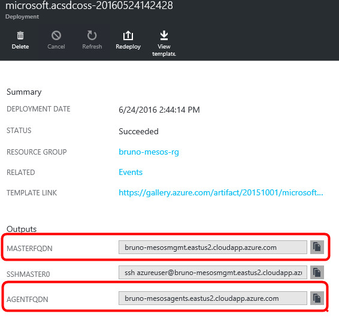
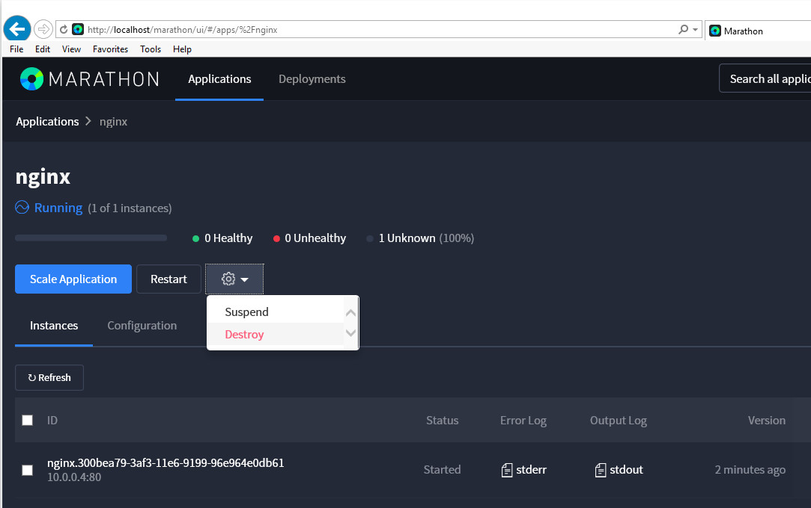
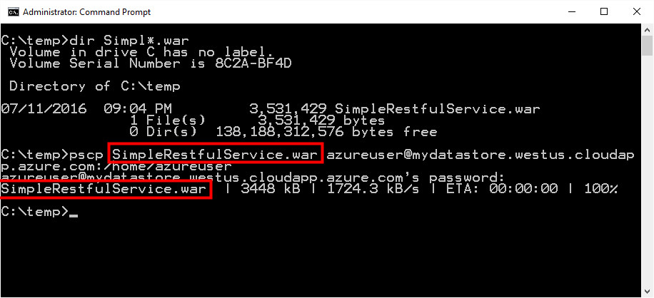
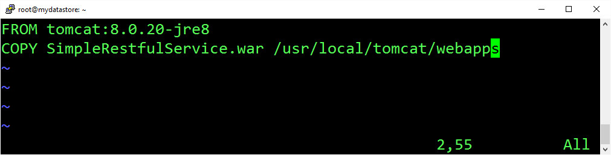
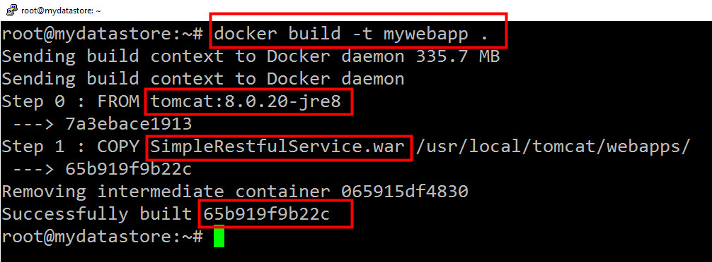
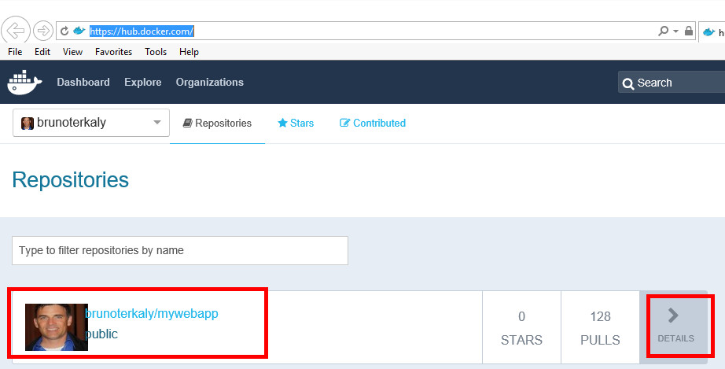

_Figure 4:  x_

_Figure 4:  x_

_Figure 4:  x_

_Figure 4:  x_

_Figure 4:  x_

_Figure 4:  x_

_Figure 4:  x_

_Figure 4:  x_

_Figure 4:  x_

_Figure 4:  x_

_Figure 4:  x_

_Figure 4:  x_

_Figure 4:  x_

_Figure 4:  x_

_Figure 4:  x_

_Figure 4:  x_

_Figure 4:  x_

_Figure 4:  x_

_Figure 4:  x_

_Figure 4:  x_

_Figure 4:  x_

_Figure 4:  x_

_Figure 4:  x_

_Figure 4:  x_

_Figure 4:  x_

_Figure 4:  x_

_Figure 4:  x_

_Figure 4:  x_

_Figure 4:  x_

_Figure 4:  x_

_Figure 4:  x_

_Figure 4:  x_

_Figure 4:  x_

_Figure 4:  x_

_Figure 4:  x_

_Figure 4:  x_

